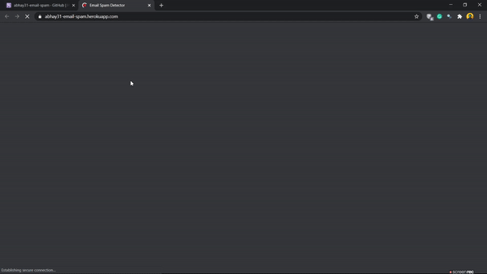

 

  

  <h3 align="center"> **Email Spam Classification Using ML** </h3>

  

Classify whether an email is spam or not.
     
    <a href=" https://abhay31-email-spam.herokuapp.com/">View Project»</a>
     
     
    <a href="https://github.com/Abhayparashar31/email_spam">Explore Codes</a>
    <a>Report Bug -> parasharabhay13@gmail.com</a>
    
  

Get It working on Your Side
 * Clone repo
 * install all the requirments
 * Run app.py 
 * Check Yor Localhost
 

For Detail Information Read my Blog

